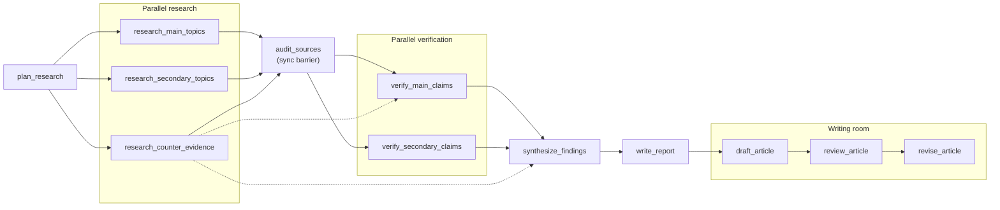
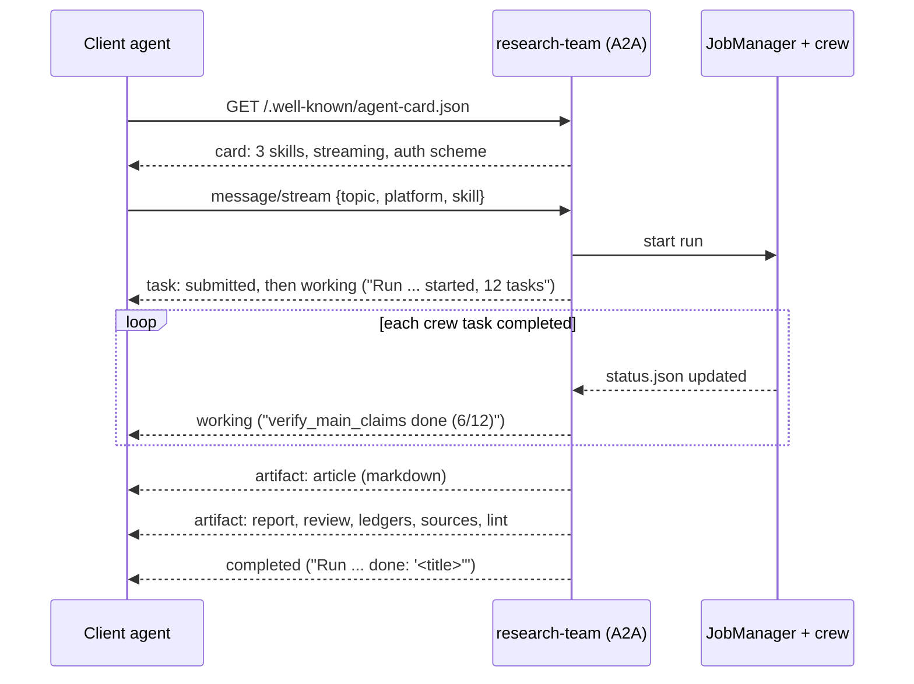

# About

<!-- badges-start -->
[](pyproject.toml) [](https://docs.crewai.com) [](#mcp-server) [](#a2a-server) [](https://github.com/aelena/crewai-research-team/actions/workflows/ci.yml) [](https://github.com/astral-sh/ruff) [](LICENSE)
<!-- badges-end -->

This repo is a fully operational CrewAI research team that plans, performs parallel research, verifies every load-bearing claim against
sources a tool actually returned, and writes a publishable piece in the style of a defined voice and style, in this case mine, but you could clone and replace that to make it your own. 

It runs from a CLI and is exposed both as an MCP server (tools for a model to call) and as an A2A agent (a peer other agents can delegate a research assignment to).

It started as a deep-research lab or demo crew (planner, researcher, fact checker, report writer, with main and secondary topics researched in parallel). This version keeps that skeleton and adds what a serious piece worthy of actual publication needs before it carries your name: 

- a contrarian research track, that tries to go against the main thesis of the piece
- a source audit
- structured claim ledgers, which means that for each research track, a typed list (a `ClaimLedger` model, not free text) of every load-bearing claim with its status (verified, contested, unverified, refuted), a confidence level, the source URLs behind the verdict and the date the figure refers to, plus chartable numbers and open gaps. Later steps can only build the argument on claims marked verified.
- a synthesis step
- citation checks against a recorded source registry
- and a writing room (draft, editorial board, revision) that is held to a voice profile and a platform's rules. Sort of final editorial review before the final piece is considered ready for publication.

---

## The pipeline



Dotted lines: the counter-evidence track also feeds main-claim verification and the synthesis directly.

--- 

## Tasks and Agents

| # | Task | Agent | Output | Checked by |
|---|---|---|---|---|
| 1 | plan_research | Research Director | `ResearchPlan`: falsifiable thesis, counter-thesis, main/secondary topics, counter-evidence targets | schema |
| 2-4 | research main / secondary / counter-evidence (parallel) | Field Researcher ×2, Contrarian Analyst | cited notes | |
| 5 | audit_sources (sync barrier) | Fact Checker | graded source register, laundered statistics, sources to drop | |
| 6-7 | verify main / secondary (parallel) | Fact Checker ×2 | `ClaimLedger`: claim, status, confidence, URLs, chartable series, gaps | every verdict has a URL; every URL was seen by a tool |
| 8 | synthesize_findings | Principal Analyst | thesis verdict, findings, mechanisms, objection, unknowns, angles | |
| 9 | write_report | Research Report Writer (+ chart tool) | `report.md`, the cited dossier | sections, ≥5 citations, no unknown URLs, no placeholders |
| 10 | draft_article | Columnist | the piece | voice rules, platform word range, min sources, no unknown URLs |
| 11 | review_article | Editorial Board (editor, SME, hostile expert) | severity-ranked review, scores, headlines | |
| 12 | revise_article | Columnist | `article.md` | same as the draft |

Stages run a prefix of this: `plan` (1), `report` (1-9), `article` (1-12).

### What makes it trustworthy enough to publish from

- **Recorded sources.** The search and scrape tools are wrapped; every URL they return goes into a per-run `SourceRegistry`. The ledgers, report and article are rejected if they cite a URL no tool ever returned, which is the cheapest reliable defence against invented references.
- **A contrarian track by design.** Counter-evidence is researched in parallel, not left to a reviewer's goodwill, and it feeds verification and synthesis.
- **Claims have states.** Verified, contested, unverified, refuted. Only verified claims may carry the argument; the rest appear as what they are.
- **Guardrails that do not kill the run.** CrewAI raises when a guardrail runs out of retries, which would discard twenty minutes of research at the final step. Guards here let the last attempt through and flag it (`guardrail_overrides` in `status.json`, `status: needs-attention` in the
  article front matter). `RESEARCH_STRICT_GUARDRAILS=true` restores fail-hard.
- **Everything on disk as it happens.** Each task's output is written the moment it completes.

## Voice profiles

`voices/*.yaml` uses the schema of the `/voice` Claude Code command (name, tone, perspective, audience, vocabulary, sentence style, hooks, paragraph style, examples) plus `structure` and `rules`.
The profile is rendered into the Columnist's and the Editorial Board's prompts, its `examples` are read in for rhythm and register, and its `rules` are enforced by a linter that the writing guardrails call:

```yaml
rules:
  no_em_dashes: true
  contractions: avoid
  max_sentence_words: 32   # warning only
  max_exclamations: 0
```

`voices/my-own-voice.yaml` is seeded from a published LinkedIn post of my own (refer to the section below to replace it with your own voice instructions file), and that post passes its own profile clean (`research-team lint references/sample-text.md`). Quotes, blockquotes, URLs and
the sources section are excluded from linting: for example, some high faluting CEO may want to say _game-changing_, but I won't :) . 

In Claude Code, `/voice` (in `.claude/commands/`) creates, analyses and switches profiles.

### Making the voice your own

The repo is opinionated with my own voice and style and that is what it ships. But if you cloned it, to make the tool speak your own voice you just need to do the following:

1. Put one or more pieces that you have written that best reflect your style and tone inside the `references/` folder, for example
   `references/sample-text.md`. Your best published post or essay is ideal; 300 words or more gives the  writers enough to match. The folder is gitignored, so `sample-text.md` is not in a fresh clone:
   `voices/my-own-voice.yaml` still loads without it, the writers just get no style examples.
2. Edit `voices/my-own-voice.yaml`: tone, audience, the words you use and the ones you never would,
   how you open and close a piece, and the `rules` you want enforced. Or, in Claude Code, run
   `/voice analyze references/sample-text.md` and let it propose the values from your text.
3. Keep `examples:` in the profile pointing at your files in `references/`.
4. Check the profile against your own writing: `research-team lint references/sample-text.md`. It must
   come back clean. If it does not, the rules are wrong, not your writing: loosen them.
5. Optional: keep several profiles side by side (`voices/<name>.yaml`) and pick one with
   `research-team voice switch <name>` or `--voice <name>` on a run.

## Platforms

`src/research_team/config/platforms.yaml`: `linkedin-article` (1200-2000 words), `linkedin-post`
(200-450), `blog-essay` (1800-3200), `substack` (1200-2200). Each sets structure, citation style and
a minimum number of distinct sources.

## Quick start

```bash
python -m venv .venv && .venv/Scripts/pip install -e ".[dev]"   # bin/ on macOS/Linux
```

Activate the virtual environment, so the `research-team` command is on your path (once per terminal):

```powershell
.venv\Scripts\Activate.ps1          # Windows PowerShell
```
```bat
.venv\Scripts\activate.bat          # Windows cmd
```
```bash
source .venv/Scripts/activate       # Git Bash on Windows
source .venv/bin/activate           # macOS / Linux
```

If PowerShell refuses to run `Activate.ps1` ("running scripts is disabled on this system"), allow local
scripts for your user once with `Set-ExecutionPolicy -Scope CurrentUser RemoteSigned`. Without activating
you can always call the command by its path: `.venv\Scripts\research-team doctor`.

```bash
cp .env.example .env  # add an LLM key and a search key of your own in .env
```
Inspect your configuration

```bash
research-team doctor                    # models per agent, which keys are present, search provider
```

produces something like the below depending on the values on your `.env` (API Keys are for you to provide):

```text
┏━━━━━━━━━━━━━━━━━━━━━━━┳━━━━━━━━┳━━━━━━━━━━━━━━━━━━━━━━━━━━━━━┓
┃ agent                 ┃ tier   ┃ model                       ┃
┡━━━━━━━━━━━━━━━━━━━━━━━╇━━━━━━━━╇━━━━━━━━━━━━━━━━━━━━━━━━━━━━━┩
│ research_planner      │ strong │ anthropic/claude-opus-5-5   │
│ topic_researcher      │ fast   │ anthropic/claude-sonnet-5-5 │
│ contrarian_researcher │ fast   │ anthropic/claude-sonnet-5-5 │
│ fact_checker          │ fast   │ anthropic/claude-sonnet-5-5 │
│ research_analyst      │ strong │ anthropic/claude-opus-5-5   │
│ report_writer         │ strong │ anthropic/claude-opus-5-5   │
│ columnist             │ strong │ anthropic/claude-opus-5-5   │
│ editorial_board       │ strong │ anthropic/claude-opus-5-5   │
└───────────────────────┴────────┴─────────────────────────────┘

keys: ANTHROPIC_API_KEY=set  OPENAI_API_KEY=set  GEMINI_API_KEY=-  EXA_API_KEY=-  SERPER_API_KEY=-  TAVILY_API_KEY=-
BRAVE_API_KEY=set
search: brave   home: <DIR>   memory: False   knowledge: False
  

```

<br/>

__How to tell it to write on a topic__

you can `--dry-run` it first, which mock-runs the entire pipeline at no cost

```bash
research-team run "Agentic AI in the aviation industry" --dry-run
```

or go for just the plan

```bash
research-team plan "Enterprise Architecture and Agentic AI adoption"   # cheap: just the plan
```

and then go for real, indicating what platform you are actually generating the piece for. `--platform`
takes one of `linkedin-article` (the default), `linkedin-post`, `blog-essay` or `substack`
(`research-team platforms` lists them with their word ranges; see [Platforms](#platforms)):

```bash
research-team run "Enterprise Architecture and Agentic AI adoption" \
  --angle "Why EA is the control plane agentic AI is missing" --platform linkedin-article
```

```bash
research-team runs
research-team lint runs/<run_id>/article.md --platform linkedin-article
```

A run writes `runs/<run_id>/`: `01-plan_research.json` ... `12-revise_article.md`, `report.md`, `article.md` (with front matter), `charts/`, `sources.json`, `lint.json` and `status.json` (state, models, timings, token usage, guardrail overrides).

---

### Models

Each agent is `fast` (tool-heavy: researchers, fact checkers) or `strong` (planner, analyst, writers, board). Defaults: `RESEARCH_LLM_FAST=anthropic/claude-sonnet-5-5`, `RESEARCH_LLM_STRONG=anthropic/claude-opus-5-5`. Any CrewAI/LiteLLM model string works, and any single agent can be overridden: `RESEARCH_LLM_COLUMNIST=...`.

Anthropic list prices per million tokens, input / output (October 2026):

| Model | Input | Output | Good for here |
|---|---|---|---|
| `claude-opus-5-5` | $4 | $20 | the prose: columnist, and the editorial board if you can afford it |
| `claude-sonnet-5-5` | $2 | $10 | judgement: planner, analyst, report writer, fact checker |
| `claude-haiku-4-5` | $1 | $5 | volume: field researchers and the contrarian researcher |

The defaults favour quality. For several runs a week, a cheaper mix that keeps the strongest model
on the only text a reader sees:

```bash
RESEARCH_LLM_FAST=anthropic/claude-haiku-4-5        # researchers, contrarian, fact checkers
RESEARCH_LLM_STRONG=anthropic/claude-sonnet-5-5     # planner, analyst, report writer, editorial board
RESEARCH_LLM_COLUMNIST=anthropic/claude-opus-5-5    # optional: Opus only for the draft and the revision
```

On list prices alone that roughly halves the cost per token for every agent. Two things to watch:

- **Fact checking is a judgement task.** If the ledgers on Haiku look careless (claims marked verified
  on weak sources), move just that agent back up: `RESEARCH_LLM_FACT_CHECKER=anthropic/claude-sonnet-5-5`.
- **Haiku 4.5 has a 200K context window** (the others have 1M). Long research loops full of scraped
  pages can approach it; the caps below help.

Model choice is not the biggest lever, though. See [Keeping the cost down](#keeping-the-cost-down).

### Search

`RESEARCH_SEARCH_PROVIDER=auto` picks the first of Exa, Serper, Tavily, Brave with a key present in your .env file. With none, the crew runs from model knowledge, citations cannot be checked, and the article is marked as `sourced: false`, so that while functional, the output will not be the best possible and you would be missing a lot of what this Crew can provide, so my recommendation is to not publish from that.

### Keeping the cost down

**Where the tokens go.** Most of a run is *input* to the five tool-using agents (two field researchers,
the contrarian, two fact checkers), not output from the writers. Every time an agent calls a tool,
CrewAI resends the whole conversation so far, every page it has scraped included. Cost therefore grows
with *result size x number of steps*. Every completed run records what it actually spent in
`runs/<run_id>/status.json` under `usage`: measure before and after any change.

**1. Work in stages.** Do not ask for the article until the research is right.

```bash
research-team run "<topic>" --stage plan      # one LLM call: is the thesis and scope right?
research-team run "<topic>" --stage report --reuse plan     # research on that plan; read report.md and the ledgers
research-team run "<topic>" --stage article --reuse report  # only draft, review, revise: no research repeated
```

Read `report.md`, `06-verify_main_claims.json` and `07-verify_secondary_claims.json` before going on. The
draft, review and revision only add cost on top of research you have already accepted, and with
`--reuse report` you can write the same research up for another platform (`--platform blog-essay`) or
another angle without paying for the research again.

**2. Reuse earlier work** (`RESEARCH_REUSE`, `RESEARCH_REUSE_FROM`, or `--reuse` / `--reuse-from`).

| `RESEARCH_REUSE` | Skips | The new run does |
|---|---|---|
| `none` (default) | nothing | everything |
| `plan` | task 1 | research, verification, synthesis, report (and the article if `--stage article`) |
| `research` | tasks 1 to 4 | source audit onwards: the way back from a run that stopped after the research tracks (credit, rate limit) |
| `report` | tasks 1 to 9 | draft, review, revise only (needs `--stage article`) |

`RESEARCH_REUSE_FROM=latest` (the default) takes the newest earlier run of the **same topic** that has
every file the reuse needs; set it to a run id (`research-team runs` lists them) to reuse a specific run,
whatever its topic. The reused files are copied into the new run so it stays complete on its own, and
the original run's recorded sources come along, so the citation guardrails still accept only URLs a
tool actually returned during that research. A failed run is reusable too, up to wherever it got: a
run that died during verification still has its plan and three research tracks, so

```bash
research-team run "<same topic>" --stage article --reuse research
```

resumes at the source audit instead of paying for the research twice.

**3. Cap what the agents read and how long they loop.**

| Setting | Default | What it does |
|---|---|---|
| `RESEARCH_TOOL_MAX_CHARS` | `12000` | Each search or scrape result is cut to this many characters before the agent sees it (a note says so). URLs past the cut are not recorded as sources, because the agent never read them. `0` = no cap. |
| `RESEARCH_AGENT_MAX_ITER` | `12` | Maximum reasoning/tool steps for each researcher and fact checker. Lower is cheaper and shallower; raise it for topics where the evidence is hard to find. |

Lowering either one trades thoroughness for cost. The defaults are a starting point, not a measured
optimum: tune them against the `usage` and the quality of the ledgers you get.

**4. Know what a run cost.** Every run, failed ones included, records tokens per model and a list-price
estimate in `status.json` under `usage`, and the CLI prints a one-line summary at the end, shaped like
this (illustrative numbers, not a measurement):

```text
tokens: 1,840,210 in / 96,402 out, 214 requests, about $4.98 at list price
```

Prices come from `src/research_team/config/prices.yaml`; edit it when prices change or to add a model
(models without a price get no estimate). It is an estimate: cache writes, discounts and how reasoning
tokens are billed are not modelled, so your invoice is the source of truth. Usage is counted once per
model, not per agent: CrewAI's own crew total adds a shared model's counters once for every agent
using it, which overstates spend several times over in this crew.

---

## MCP server

```bash
research-team mcp           # stdio (Claude Code / Desktop)
research-team mcp --transport streamable-http --port 8765
```

`.mcp.json` registers it for Claude Code in this folder. Tools: `start_research` (returns a run id
immediately; runs take many minutes), `research_status`, `get_artifact`, `list_runs`, `list_voices`,
`get_voice`, `list_platforms`, `lint_text` (no LLM: check any text against a voice). Resources:
`research://runs/{run_id}/{name}`, `voice://{name}`. `start_research` takes `dry_run: true` for
testing a client for free.

CrewAI prints to stdout, which would corrupt a stdio JSON-RPC stream. The server writes protocol
messages to the real stdout and sends everything else to stderr; `tests/test_mcp_stdio.py` spawns
the server with verbose logging on and runs a job through it to prove it.

## A2A server

```bash
research-team a2a                     # http://127.0.0.1:8766, card at /.well-known/agent-card.json
research-team a2a --host 0.0.0.0 --port 8766 --public-url https://research.example.org/
```

### MCP and A2A are not the same thing

Both expose the same crew, but they answer different questions.

- **MCP** lets a model *use tools*. Claude (or any MCP client) sees `start_research`, `research_status`,
  `get_artifact` as functions it can call, and it stays in charge: it decides when to poll and what to do
  with the result. The research team is an instrument in someone else's hands.
- **A2A** (Agent2Agent) lets an agent *delegate work to another agent*. The client does not see tools or
  internals; it sends a message to a peer, gets a **task** back, and follows that task until the peer
  hands over **artifacts**. The research team is a colleague you give an assignment to.

That makes A2A the better fit for this crew: a 20-minute piece of work with progress, an outcome and
deliverables is exactly what an A2A task models.

### How a run looks over A2A



1. **Discovery.** The client reads the **agent card**: name, description, the skills on offer, which
   input and output formats it accepts, whether it streams, and how to authenticate.
2. **Skills** map onto the stages: `research-plan` (stage `plan`), `research-report` (`report`),
   `voiced-article` (`article`). A skill is picked by id; `stage` in the request overrides it.
3. **The request** is an A2A message. A `DataPart` carries the same fields as the CLI (`topic`, `angle`,
   `audience`, `notes`, `platform`, `voice`, `stage`, `dry_run`, `skill`); plain text works too and is
   taken as the topic. Bad input (unknown voice or platform) ends the task as `rejected` with the reason.
4. **The task** moves `submitted -> working -> completed` (or `failed`). Every crew task that finishes
   becomes a `working` status update with the run id, completed and pending tasks in its metadata.
5. **Artifacts** arrive at the end: `article`, `report` and `review` as markdown text, the claim ledgers,
   `sources` and `lint` as JSON data. What you get depends on the stage.

There are three ways to follow a task, all supported:

- **Stream** (`message/stream`): one connection, server-sent events as they happen. Best for an agent
  that waits.
- **Send and poll** (`message/send` with `blocking: false`, then `tasks/get`): the call returns at once
  with the task id. Best for a run that outlives the caller's patience.
- **Blocking send** (`message/send`): returns when the task is done. Fine for `research-plan`, a poor
  idea for a 20-minute article.

### Try it

```bash
research-team a2a &     # give it a few seconds: importing CrewAI is slow
curl -s http://127.0.0.1:8766/.well-known/agent-card.json

# start a free dry run, non-blocking: returns the task id straight away
curl -s http://127.0.0.1:8766/ -H "Content-Type: application/json" -d '{
  "jsonrpc": "2.0", "id": 1, "method": "message/send",
  "params": {
    "configuration": {"blocking": false},
    "message": {"role": "user", "messageId": "m1", "kind": "message",
      "parts": [{"kind": "data", "data": {"topic": "Agentic AI in the aviation industry", "dry_run": true}}]}
  }}'

# follow it
curl -s http://127.0.0.1:8766/ -H "Content-Type: application/json" \
  -d '{"jsonrpc": "2.0", "id": 2, "method": "tasks/get", "params": {"id": "<task id>"}}'
```

From Python, with the official SDK:

```python
import httpx
from uuid import uuid4
from a2a.client import ClientConfig, ClientFactory
from a2a.types import DataPart, Message, Part, Role

async with httpx.AsyncClient(timeout=None) as http:
    client = await ClientFactory.connect("http://127.0.0.1:8766",
                                         client_config=ClientConfig(httpx_client=http, streaming=True))
    msg = Message(role=Role.user, message_id=uuid4().hex, parts=[Part(root=DataPart(data={
        "topic": "Enterprise Architecture and agentic AI adoption", "skill": "voiced-article"}))])
    async for task, event in client.send_message(msg):
        ...  # status updates while it works; task.artifacts when it completes
```

### Operational notes

- **Auth.** Set `RESEARCH_A2A_TOKEN` and every request except the agent card needs
  `Authorization: Bearer <token>`; the card then declares the bearer scheme so clients know. Without
  the token the server is open: keep it on `127.0.0.1`.
- **Tasks survive restarts.** A2A task records are stored in `runs/.a2a-tasks/`, so `tasks/get` still
  answers for finished tasks after the server restarts. A run that was *in progress* when the server
  stopped does not resume.
- **No cancel.** CrewAI cannot stop a kickoff midway, so `tasks/cancel` answers "unsupported" rather
  than pretending. Push notifications and `input-required` (for example, pausing for you to approve the
  plan) are not implemented yet.
- **One engine.** The A2A executor does not run the crew: it starts a job on `JobManager` and follows
  its `status.json`. CLI, MCP and A2A runs all land in `runs/` and are visible to each other.
- **Version.** Built on `a2a-sdk` 0.3 (A2A protocol 0.3), the line CrewAI's own `crewai[a2a]` extra
  pins; the SDK's 1.x line would make the two impossible to install together.

Design rationale and the mapping table: [docs/a2a.md](docs/a2a.md).

## Development

```bash
.venv/Scripts/python -m pytest -q     # no keys, no network: includes real stdio MCP and A2A client round trips
.venv/Scripts/ruff check src tests
```

The dry-run LLM (`dryrun.py`) answers every task with schema-valid placeholder content, and its
first draft deliberately breaks the voice rules, so the tests see a guardrail reject a draft and
accept the retry.

Notes for CrewAI 1.15: one agent instance cannot run two async tasks at once ("Executor is already
running"), so the parallel secondary tracks get their own instance of the same YAML agent; an
async task cannot read another async task's output without a sync task in between, hence the
audit barrier; guardrails must be plain functions, not callable objects.

## License

MIT
