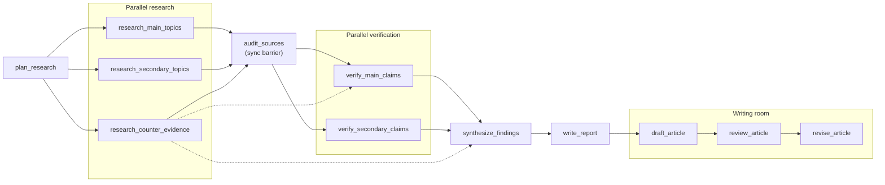

# About

<!-- badges-start -->
[](pyproject.toml) [](https://docs.crewai.com) [](#mcp-server) [](docs/a2a.md) [](tests) [](https://github.com/astral-sh/ruff) [](LICENSE)
<!-- badges-end -->

This repo is a fully operational CrewAI research team that plans, performs parallel research, verifies every load-bearing claim against
sources a tool actually returned, and writes a publishable piece in the style of a defined voice and style, in this case mine, but you could clone and replace that to make it your own. 

It runs from a CLI and is exposed as an MCP server, with an A2A adapter designed and next in line.

It started as a deep-research lab or demo crew (planner, researcher, fact checker, report writer, with main and secondary topics researched in parallel). This version keeps that skeleton and adds what a serious piece worthy of actual publication needs before it carries your name: 

- a contrarian research track, that tries to go against the main thesis of the piece
- a source audit
- structured claim ledgers, which means that for each research track, a typed list (a `ClaimLedger` model, not free text) of every load-bearing claim with its status (verified, contested, unverified, refuted), a confidence level, the source URLs behind the verdict and the date the figure refers to, plus chartable numbers and open gaps. Later steps can only build the argument on claims marked verified.
- a synthesis step
- citation checks against a recorded source registry
- and a writing room (draft, editorial board, revision) that is held to a voice profile and a platform's rules. Sort of final editorial review before the final piece is considered ready for publication.

---

## The pipeline



Dotted lines: the counter-evidence track also feeds main-claim verification and the synthesis directly.

--- 

## Tasks and Agents

| # | Task | Agent | Output | Checked by |
|---|---|---|---|---|
| 1 | plan_research | Research Director | `ResearchPlan`: falsifiable thesis, counter-thesis, main/secondary topics, counter-evidence targets | schema |
| 2-4 | research main / secondary / counter-evidence (parallel) | Field Researcher ×2, Contrarian Analyst | cited notes | |
| 5 | audit_sources (sync barrier) | Fact Checker | graded source register, laundered statistics, sources to drop | |
| 6-7 | verify main / secondary (parallel) | Fact Checker ×2 | `ClaimLedger`: claim, status, confidence, URLs, chartable series, gaps | every verdict has a URL; every URL was seen by a tool |
| 8 | synthesize_findings | Principal Analyst | thesis verdict, findings, mechanisms, objection, unknowns, angles | |
| 9 | write_report | Research Report Writer (+ chart tool) | `report.md`, the cited dossier | sections, ≥5 citations, no unknown URLs, no placeholders |
| 10 | draft_article | Columnist | the piece | voice rules, platform word range, min sources, no unknown URLs |
| 11 | review_article | Editorial Board (editor, SME, hostile expert) | severity-ranked review, scores, headlines | |
| 12 | revise_article | Columnist | `article.md` | same as the draft |

Stages run a prefix of this: `plan` (1), `report` (1-9), `article` (1-12).

### What makes it trustworthy enough to publish from

- **Recorded sources.** The search and scrape tools are wrapped; every URL they return goes into a per-run `SourceRegistry`. The ledgers, report and article are rejected if they cite a URL no tool ever returned, which is the cheapest reliable defence against invented references.
- **A contrarian track by design.** Counter-evidence is researched in parallel, not left to a reviewer's goodwill, and it feeds verification and synthesis.
- **Claims have states.** Verified, contested, unverified, refuted. Only verified claims may carry the argument; the rest appear as what they are.
- **Guardrails that do not kill the run.** CrewAI raises when a guardrail runs out of retries, which would discard twenty minutes of research at the final step. Guards here let the last attempt through and flag it (`guardrail_overrides` in `status.json`, `status: needs-attention` in the
  article front matter). `RESEARCH_STRICT_GUARDRAILS=true` restores fail-hard.
- **Everything on disk as it happens.** Each task's output is written the moment it completes.

## Voice profiles

`voices/*.yaml` uses the schema of the `/voice` Claude Code command (name, tone, perspective, audience, vocabulary, sentence style, hooks, paragraph style, examples) plus `structure` and `rules`.
The profile is rendered into the Columnist's and the Editorial Board's prompts, its `examples` are read in for rhythm and register, and its `rules` are enforced by a linter that the writing guardrails call:

```yaml
rules:
  no_em_dashes: true
  contractions: avoid
  max_sentence_words: 32   # warning only
  max_exclamations: 0
```

`voices/my-own-voice.yaml` is seeded from a published LinkedIn post of my own (refer to the section below to replace it with your own voice instructions file), and that post passes its own profile clean (`research-team lint references/sample-text.md`). Quotes, blockquotes, URLs and
the sources section are excluded from linting: for example, some high faluting CEO may want to say _game-changing_, but I won't :) . 

In Claude Code, `/voice` (in `.claude/commands/`) creates, analyses and switches profiles.

### Making the voice your own

The repo is opinionated with my own voice and style and that is what it ships. But if you cloned it, to make the tool speak your own voice you just need to do the following:

1. Put one or more pieces that you have written that best reflect your style and tone inside the `references/` folder, for example
   `references/sample-text.md`. Your best published post or essay is ideal; 300 words or more gives the  writers enough to match. The folder is gitignored, so `sample-text.md` is not in a fresh clone:
   `voices/my-own-voice.yaml` still loads without it, the writers just get no style examples.
2. Edit `voices/my-own-voice.yaml`: tone, audience, the words you use and the ones you never would,
   how you open and close a piece, and the `rules` you want enforced. Or, in Claude Code, run
   `/voice analyze references/sample-text.md` and let it propose the values from your text.
3. Keep `examples:` in the profile pointing at your files in `references/`.
4. Check the profile against your own writing: `research-team lint references/sample-text.md`. It must
   come back clean. If it does not, the rules are wrong, not your writing: loosen them.
5. Optional: keep several profiles side by side (`voices/<name>.yaml`) and pick one with
   `research-team voice switch <name>` or `--voice <name>` on a run.

## Platforms

`src/research_team/config/platforms.yaml`: `linkedin-article` (1200-2000 words), `linkedin-post`
(200-450), `blog-essay` (1800-3200), `substack` (1200-2200). Each sets structure, citation style and
a minimum number of distinct sources.

## Quick start

```bash
python -m venv .venv && .venv/Scripts/pip install -e ".[dev]"   # bin/ on macOS/Linux
```
```bash
cp .env.example .env  # add an LLM key and a search key of your own in .env
```

```bash
research-team doctor                    # models per agent, which keys are present, search provider
```

__How to tell it to write on a topic__

you can `--dry-run` it first:

```bash
research-team run "Agentic AI in the aviation industry" --dry-run   # whole pipeline offline, free
```

or go for just the plan

```bash
research-team plan "Enterprise Architecture and Agentic AI adoption"   # cheap: just the plan
```

and then go for real, indicating what platform you are actually generating the piece for. `--platform`
takes one of `linkedin-article` (the default), `linkedin-post`, `blog-essay` or `substack`
(`research-team platforms` lists them with their word ranges; see [Platforms](#platforms)):

```bash
research-team run "Enterprise Architecture and Agentic AI adoption" \
  --angle "Why EA is the control plane agentic AI is missing" --platform linkedin-article
```

```bash
research-team runs
research-team lint runs/<run_id>/article.md --platform linkedin-article
```

A run writes `runs/<run_id>/`: `01-plan_research.json` ... `12-revise_article.md`, `report.md`, `article.md` (with front matter), `charts/`, `sources.json`, `lint.json` and `status.json` (state, models, timings, token usage, guardrail overrides).

---

### Models

Each agent is `fast` (tool-heavy: researchers, fact checkers) or `strong` (planner, analyst, writers, board). Defaults: `RESEARCH_LLM_FAST=anthropic/claude-sonnet-5-5`, `RESEARCH_LLM_STRONG=anthropic/claude-opus-5-5`. Any CrewAI/LiteLLM model string works, and any single agent can be overridden: `RESEARCH_LLM_COLUMNIST=...`.

### Search

`RESEARCH_SEARCH_PROVIDER=auto` picks the first of Exa, Serper, Tavily, Brave with a key present in your .env file. With none, the crew runs from model knowledge, citations cannot be checked, and the article is marked as `sourced: false`, so that while functional, the output will not be the best possible and you would be missing a lot of what this Crew can provide, so my recommendation is to not publish from that.

---

## MCP server

```bash
research-team mcp           # stdio (Claude Code / Desktop)
research-team mcp --transport streamable-http --port 8765
```

`.mcp.json` registers it for Claude Code in this folder. Tools: `start_research` (returns a run id
immediately; runs take many minutes), `research_status`, `get_artifact`, `list_runs`, `list_voices`,
`get_voice`, `list_platforms`, `lint_text` (no LLM: check any text against a voice). Resources:
`research://runs/{run_id}/{name}`, `voice://{name}`. `start_research` takes `dry_run: true` for
testing a client for free.

CrewAI prints to stdout, which would corrupt a stdio JSON-RPC stream. The server writes protocol
messages to the real stdout and sends everything else to stderr; `tests/test_mcp_stdio.py` spawns
the server with verbose logging on and runs a job through it to prove it.

## A2A

Designed, not built: [docs/a2a.md](docs/a2a.md) maps runs onto A2A tasks and drafts the agent card.
`jobs.JobManager` is the transport-neutral service both adapters sit on.

## Development

```bash
.venv/Scripts/python -m pytest -q     # 33 tests, no keys, no network
.venv/Scripts/ruff check src tests
```

The dry-run LLM (`dryrun.py`) answers every task with schema-valid placeholder content, and its
first draft deliberately breaks the voice rules, so the tests see a guardrail reject a draft and
accept the retry.

Notes for CrewAI 1.15: one agent instance cannot run two async tasks at once ("Executor is already
running"), so the parallel secondary tracks get their own instance of the same YAML agent; an
async task cannot read another async task's output without a sync task in between, hence the
audit barrier; guardrails must be plain functions, not callable objects.

## License

MIT
